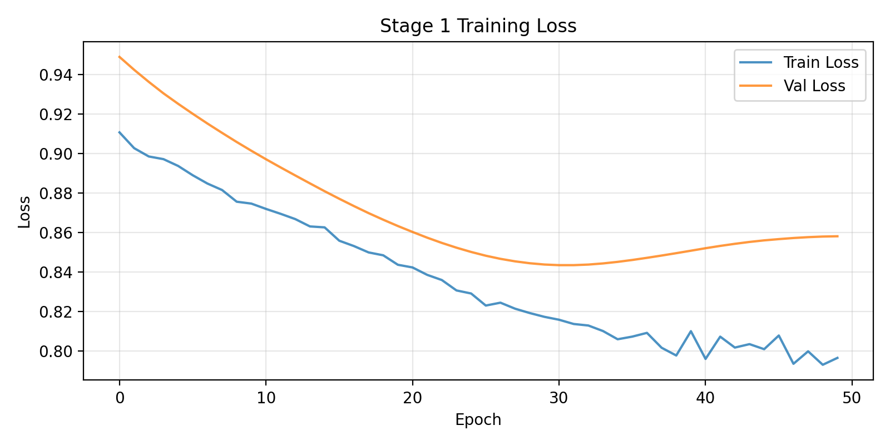
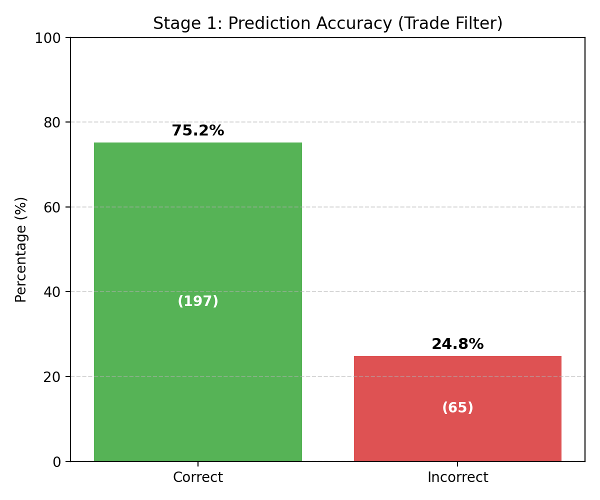
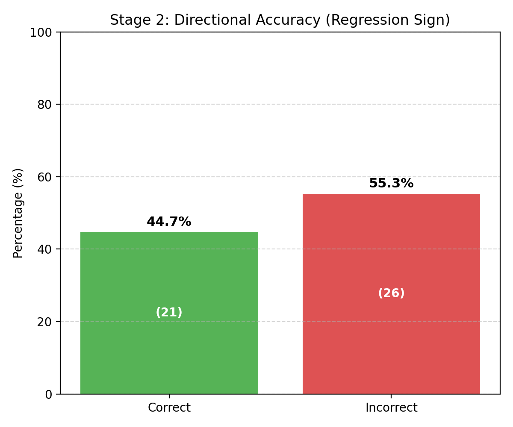
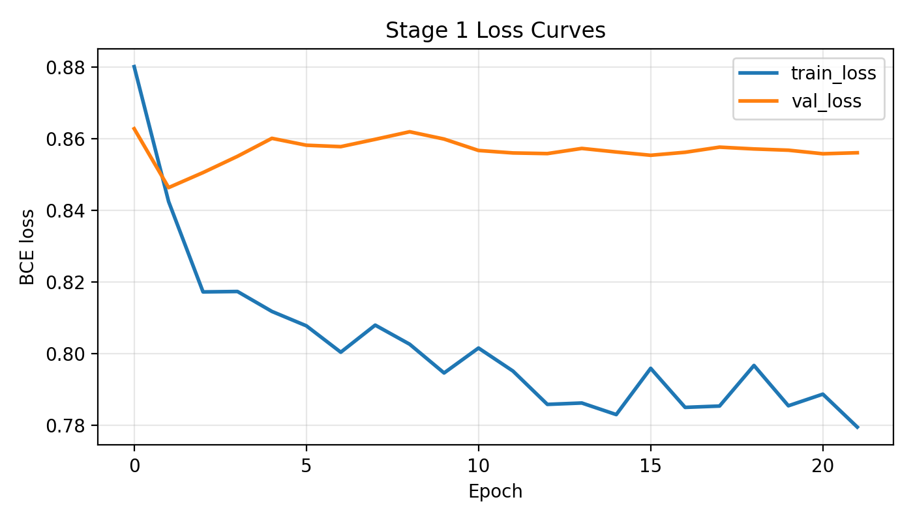
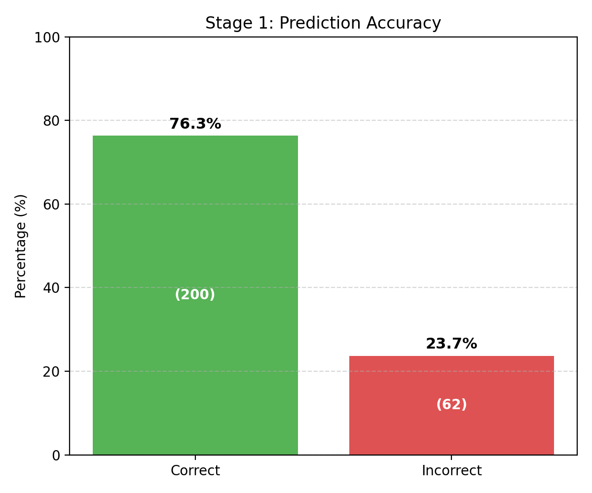
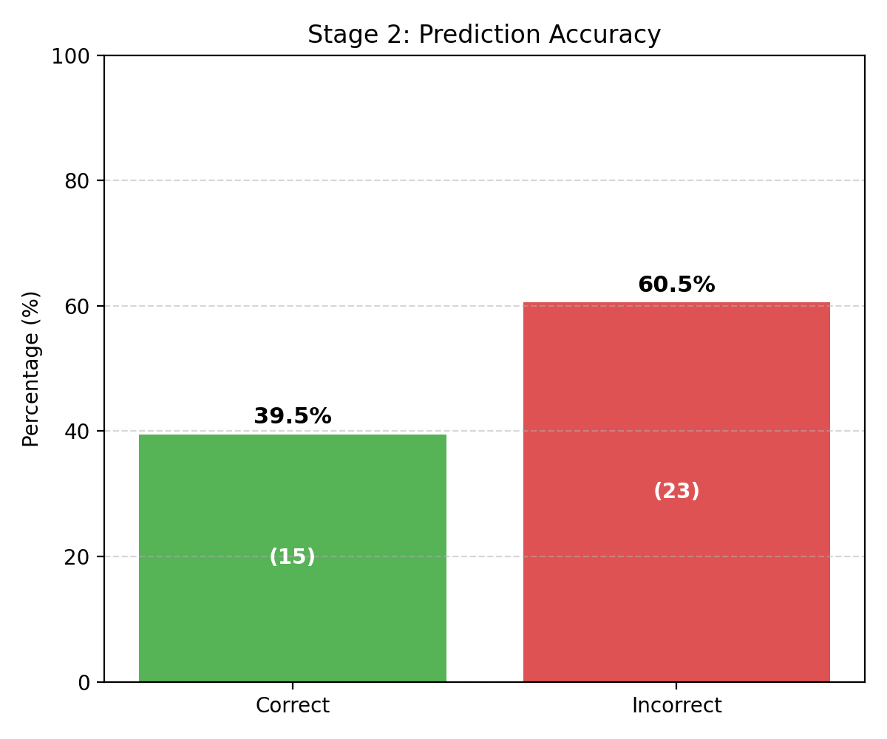

# Iteration 1: Event-Driven Trading Pipeline Entwicklung

Dieses Dokument beschreibt die Entwicklung und Evolution der Trading-Modelle während der ersten Iteration.

## 1. Pre-Split Preparation

### [scripts/03_pre_split_prep/build_event_dataset.py](nasdaq_trading_bot/scripts/03_pre_split_prep/build_event_dataset.py)
- **Aufgabe**: Scannt die Rohdaten nach Nachrichten-Events.
- **Prüfung**: Prüft für jedes Event, ob genügend Daten für den Zeitraum -20 min (Pre) und +60 min (Post) vorhanden sind.
- **Logik**: Wendet die "Lockout"-Logik an (keine überlappenden Events).
- **Ergebnis**: Speichert eine Liste der validen Events (mit Zeitstempel) als `news_events_metadata.csv` (nicht die Kursdaten selbst, nur Metadaten).

#### Data Sample: news_events_metadata.csv
| event_id | event_time                | news_id   | news_sentiment        | is_valid | pre_bars | post_bars | pre_coverage_pct | post_coverage_pct | pre_start                | pre_end                  | post_start               |
|---------:|---------------------------|-----------|------------------------|----------|---------:|----------:|-----------------:|------------------:|--------------------------|--------------------------|--------------------------|
| 0        | 2020-12-02 14:46:00+00:00 | 18616016  | 0.0140573233366012    | True     | 16       | 61        | 80.0             | 101.66666666666666| 2020-12-02 14:30:00+00:00 | 2020-12-02 14:45:00+00:00 | 2020-12-02 14:46:00+00:00 |
| 1        | 2020-12-30 20:01:00+00:00 | 18967234  | 0.015524560585618    | True     | 20       | 59        | 100.0            | 98.33333333333333 | 2020-12-30 19:41:00+00:00 | 2020-12-30 20:00:00+00:00 | 2020-12-30 20:01:00+00:00 |
| 2        | 2021-01-05 18:51:00+00:00 | 19011505  | -0.5920711755752563  | True     | 20       | 61        | 100.0            | 101.66666666666666| 2021-01-05 18:31:00+00:00 | 2021-01-05 18:50:00+00:00 | 2021-01-05 18:51:00+00:00 |
| 3        | 2021-01-27 16:00:00+00:00 | 9748301   | 0.5891687870025635   | True     | 20       | 61        | 100.0            | 101.66666666666666| 2021-01-27 15:40:00+00:00 | 2021-01-27 15:59:00+00:00 | 2021-01-27 16:00:00+00:00 |
| 4        | 2021-02-18 18:46:00+00:00 | 19732019  | 0.148224800825119    | True     | 20       | 61        | 100.0            | 101.66666666666666| 2021-02-18 18:26:00+00:00 | 2021-02-18 18:45:00+00:00 | 2021-02-18 18:46:00+00:00 |
| 5        | 2021-02-26 17:09:00+00:00 | 19884267  | 0.7712897062301636   | True     | 20       | 61        | 100.0            | 101.66666666666666| 2021-02-26 16:49:00+00:00 | 2021-02-26 17:08:00+00:00 | 2021-02-26 17:09:00+00:00 |
| 6        | 2021-03-02 17:23:00+00:00 | 19945129  | 0.8800390958786011   | True     | 20       | 61        | 100.0            | 101.66666666666666| 2021-03-02 17:03:00+00:00 | 2021-03-02 17:22:00+00:00 | 2021-03-02 17:23:00+00:00 |
| 7        | 2021-03-09 17:25:00+00:00 | 20082000  | -0.5031403303146362  | True     | 20       | 61        | 100.0            | 101.66666666666666| 2021-03-09 17:05:00+00:00 | 2021-03-09 17:24:00+00:00 | 2021-03-09 17:25:00+00:00 |
| 8        | 2021-03-12 17:21:00+00:00 | 20145829  | 0.0308342203497886   | True     | 20       | 61        | 100.0            | 101.66666666666666| 2021-03-12 17:01:00+00:00 | 2021-03-12 17:20:00+00:00 | 2021-03-12 17:21:00+00:00 |
| 9        | 2021-04-28 14:40:00+00:00 | 20839433  | -0.924789309501648  | True     | 20       | 61        | 100.0            | 101.66666666666666| 2021-04-28 14:20:00+00:00 | 2021-04-28 14:39:00+00:00 | 2021-04-28 14:40:00+00:00 |

### [scripts/03_pre_split_prep/event_features.py](nasdaq_trading_bot/scripts/03_pre_split_prep/event_features.py) & [scripts/03_pre_split_prep/event_targets.py](nasdaq_trading_bot/scripts/03_pre_split_prep/event_targets.py) 
- **Aufgabe**: Diese Skripte enthalten nur die *Berechnungslogik*.
- **Funktion**: Sie wissen, wie man aus einem Zeitfenster Features (Momentum, Volatilität vor dem Event) und Targets (Returns nach dem Event) berechnet.

### [scripts/03_pre_split_prep/build_event_dataset.py](nasdaq_trading_bot/scripts/03_pre_split_prep/build_event_dataset.py)
- **Aufgabe**: Lädt die Rohdaten (Preise) und die Metadaten (Liste der validen Events aus Schritt 1).
- **Logik**: Geht jedes Event durch und schneidet "live" die Fenster (-20 min Pre / +60 min Post) aus den Rohdaten aus.
- **Abhängigkeit**: Benutzt `event_features.py` für die Inputs und `event_targets.py` für die Outputs.
- **Ergebnis**: Die finale Datei `event_dataset.csv`, die für das ML-Training genutzt wird.

#### Data Sample: event_dataset.csv
| event_id | event_time                | news_id   | news_headline | pre_return_5m        | pre_return_10m       | pre_return_20m       | pre_price_trend     | pre_price_std       | pre_volume_mean | pre_volume_std     |
|---------:|---------------------------|-----------|---------------|----------------------|----------------------|----------------------|---------------------|---------------------|-----------------:|--------------------|
| 0        | 2020-12-02 14:46:00+00:00 | 18616016  | null          | -0.08584280465611105 | -0.28101439342015366 | -0.5536568694463395  | -0.0768088235294028 | 0.4254522103989267 | 179382.5        | 110236.89966552338 |
| 1        | 2020-12-30 20:01:00+00:00 | 18967234  | null          | 0.019764147835821255 | -0.0395048722675817  | -0.023048302657135977| -0.008654135338352688| 0.07963568361773317| 16371.15        | 5309.184666088925  |
| 2        | 2021-01-05 18:51:00+00:00 | 19011505  | null          | -0.009949918742324648| 0.07302662152295358  | 0.16945210486094542 | 0.020601503759393187| 0.1375193766251429 | 26655.0         | 25951.861432072143 |
| 3        | 2021-01-27 16:00:00+00:00 | 9748301   | null          | -0.09168221048971859 | 0.034820043683314594| 0.26651437273973682 | 0.05639849624059473 | 0.37415554041207666| 46664.25        | 25386.0985163451   |
| 4        | 2021-02-18 18:46:00+00:00 | 19732019  | null          | 0.0031089693766750415| -0.024864797662704774| 0.06221613886645329 | 0.0009699248120240682| 0.10366316911796783| 55743.25        | 73137.51127040725  |
| 5        | 2021-02-26 17:09:00+00:00 | 19884267  | null          | -0.06820396232541936 | -0.06829712501625895| 0.0520274447696528  | -0.001676917293295188| 0.22711636247805106| 130465.5        | 61439.80232415774  |
| 6        | 2021-03-02 17:23:00+00:00 | 19945129  | null          | -0.01284439021258521 | 0.06427148274310568 | 0.24144480571741678 | 0.03267669172932002 | 0.24669606273392955| 96808.25        | 57846.5477584081   |
| 7        | 2021-03-09 17:25:00+00:00 | 20082000  | null          | 0.12576951082279297  | 0.07277538868672995 | 0.27844073190135266 | 0.025676691729321105| 0.21638841782410767| 94501.7         | 28936.823702862177 |
| 8        | 2021-03-12 17:21:00+00:00 | 20145829  | null          | -0.03605375286791501 | 0.151052441467181   | 0.23004370830457255 | 0.051624060150368516| 0.32762944408520467| 90581.65        | 36209.78579171077  |
| 9        | 2021-04-28 14:40:00+00:00 | 20839433  | null          | 0.018201122402539127 | -0.16635545891274196| -0.2903196540357533 | -0.06681954887218239| 0.4088169710145024 | 117399.2        | 184925.38897153543 |

---

## 2. Data Split

### [scripts/04_split_data/event_data_split.py](nasdaq_trading_bot/scripts/04_split_data/event_data_split.py) (Die Trennung)
- **Aufgabe**: Teilt den `event_dataset.csv` in Train, Validation und Test auf.
- **Wichtiges Detail**: Das passiert **chronologisch** (temporal split), nicht zufällig. Das ist entscheidend für Zeitreihen/Trading, damit das Modell nicht "in die Zukunft schauen" kann (kein *Look-ahead Bias*).
- **Ergebnis**: 3 Dateien (`event_train.csv`, `event_validation.csv`, `event_test.csv`).

#### Data Sample: event_train.csv
| event_id | event_time                | news_id   | news_headline | pre_return_5m        | pre_return_10m       | pre_return_20m       | pre_price_trend     | pre_price_std       | pre_volume_mean | pre_volume_std     |
|---------:|---------------------------|-----------|---------------|----------------------|----------------------|----------------------|---------------------|---------------------|-----------------:|--------------------|
| 0        | 2020-12-02 14:46:00+00:00 | 18616016  | null          | -0.085842804656111   | -0.2810143934201536 | -0.5536568694463395 | -0.0768088235294028 | 0.4254522103989267 | 179382.5        | 110236.89966552338 |
| 1        | 2020-12-30 20:01:00+00:00 | 18967234  | null          | 0.0197641478358212  | -0.0395048722675817 | -0.0230483026571359| -0.0086541353383526| 0.0796356836177331 | 16371.15        | 5309.184666088925  |
| 2        | 2021-01-05 18:51:00+00:00 | 19011505  | null          | -0.0099499187423246 | 0.0730266215229535  | 0.1694521048609454 | 0.0206015037593931 | 0.1375193766251429 | 26655.0         | 25951.861432072143 |
| 3        | 2021-01-27 16:00:00+00:00 | 9748301   | null          | -0.0916822104897185 | 0.0348200436833145  | 0.2665143727397368 | 0.0563984962405947 | 0.3741555404120766 | 46664.25        | 25386.0985163451   |
| 4        | 2021-02-18 18:46:00+00:00 | 19732019  | null          | 0.0031089693766750  | -0.0248647976627047 | 0.0622161388664533 | 0.0009699248120240 | 0.1036631691179678 | 55743.25        | 73137.51127040725  |
| 5        | 2021-02-26 17:09:00+00:00 | 19884267  | null          | -0.0682039623254193 | 0.0682971250162589  | 0.052027444769652  | -0.0016766917293295| 0.2271163624780510 | 130465.5        | 61439.80232415774  |
| 6        | 2021-03-02 17:23:00+00:00 | 19945129  | null          | -0.0128443902125852 | 0.0642714827431056  | 0.2414448057174167 | 0.03267669172932   | 0.2466960627339295 | 96808.25        | 57846.5477584081   |
| 7        | 2021-03-09 17:25:00+00:00 | 20082000  | null          | 0.1257695108227929  | 0.0727753886867299  | 0.2784407319013526 | 0.0256766917293211 | 0.2163884178241076 | 94501.7         | 28936.823702862177 |
| 8        | 2021-03-12 17:21:00+00:00 | 20145829  | null          | -0.0360537528679150 | 0.1510524414671810  | 0.2300437083045725 | 0.0516240601503685 | 0.3276294440852046 | 90581.65        | 36209.78579171077  |
| 9        | 2021-04-28 14:40:00+00:00 | 20839433  | null          | 0.0182011224025391  | -0.1663554589127419 | -0.2903196540357533| -0.0668195488721823| 0.4088169710145024 | 117399.2        | 184925.38897153543 |

#### Data Sample: event_validation.csv
| event_id | event_time                | news_id   | news_headline | pre_return_5m        | pre_return_10m       | pre_return_20m       | pre_price_trend     | pre_price_std       | pre_volume_mean | pre_volume_std     | pre_volume_spike |
|---------:|---------------------------|-----------|---------------|----------------------|----------------------|----------------------|---------------------|---------------------|-----------------:|--------------------|------------------:|
| 1357 | 2024-10-15 19:16:00+00:00 | 41343089 | null | -0.0800607640670802 | -0.022594228201711 | -0.3215170690749724 | -0.088075187969935 | 0.5860043111032416 | 113940.9 | 85410.44826255467 | 3.355318415 |
| 1358 | 2024-10-16 14:26:00+00:00 | 41358339 | null | 0.1190134197890602 | 0.1375064135454184 | 0.3785385121790607 | 0.0661654135338236 | 0.4550026026530553 | 97476.05 | 87270.4951518553 | 3.814608819 |
| 1359 | 2024-10-16 17:45:00+00:00 | 41364779 | null | 0.0759005497661391 | 0.0061498093559153 | 0.1025956704627129 | 0.0060977443609006 | 0.13476197339637 | 20651.55 | 13688.080433162891 | 3.461967745 |
| 1361 | 2024-10-17 14:20:00+00:00 | 41382818 | null | 0.0367301963025035 | 0.2125919869174097 | -0.0570822800293524 | 0.0033007518796938 | 0.39670319012157 | 8758.7 | 41895.0034266115 | 2.165301677 |
| 1362 | 2024-10-17 15:50:00+00:00 | 41385390 | null | -0.0142473337132575 | -0.0366278005005771 | 0.0611060189428691 | 0.0169624060150298 | 0.1697397388573669 | 39829.75 | 32731.529791825466 | 4.01594285 |
| 1363 | 2024-10-17 17:29:00+00:00 | 41387939 | null | 0.0162796849880964 | -0.008137855268242 | -0.008137855268242 | -0.0079172932330903 | 0.1057243187679511 | 16931.3 | 7269.603378017552 | 2.19670078 |
| 1364 | 2024-10-18 16:44:00+00:00 | 41406883 | null | 0.0589838506284801 | 0.054913765050446 | 0.0895200504567483 | 0.0278195488721639 | 0.1930884716774628 | 53171.45 | 73563.83480565132 | 6.30140799 |
| 1365 | 2024-10-18 17:32:00+00:00 | 41407790 | null | -0.0792183786638478 | -0.131960395618814 | -0.1481782198315184 | -0.0285187969924916 | 0.2088029794100734 | 34054.6 | 29161.096713186034 | 4.1507755 |
| 1366 | 2024-10-21 17:28:00+00:00 | 41435187 | null | 0.0427263479145345 | -0.0142340070763302 | 0.0244105860574883 | -0.0106466165413563 | 0.1792851301551199 | 47506.15 | 54022.80000174877 | 5.54772382 |

#### Data Sample: event_test.csv
| event_id | event_time                | news_id   | news_headline | pre_return_5m        | pre_return_10m       | pre_return_20m       | pre_price_trend     | pre_price_std       | pre_volume_mean | pre_volume_std     | pre_volume_spike |
|---------:|---------------------------|-----------|---------------|----------------------|----------------------|----------------------|---------------------|---------------------|-----------------:|--------------------|------------------:|
| 1651 | 2025-04-28 15:45:00+00:00 | 45044269 | null | 0.0256607646907935 | 0.1820479321496648 | 0.0984378343676484 | 0.07157894736841 | 0.5138615418675767 | 102793.45 | 70684.40609496106 | 3.53133395 |
| 1652 | 2025-04-29 14:22:00+00:00 | 45069781 | null | -0.0296748484463038 | -0.1037849744773722 | 0.014844031638983 | -0.007180451127834 | 0.4882781239737364 | 85739.6 | 28737.58850154637 | 1.79799086 |
| 1653 | 2025-04-29 18:14:00+00:00 | 45078739 | null | -0.075794260690154 | -0.058961022552538 | 0.0379402651603077 | 0.0113383458646553 | 0.210578151532476 | 81728.65 | 54527.905751164646 | 3.01563772 |
| 1654 | 2025-04-30 16:19:00+00:00 | 45108426 | null | -0.0085278754930251 | -0.1235119988296396 | -0.1213850675071293 | -0.0337819548872322 | 0.3832310695019089 | 75668.7 | 44337.06545152297 | 2.64936492 |
| 1655 | 2025-04-30 18:00:00+00:00 | 45111682 | null | -0.0488395302911337 | 0.0361294710220505 | 0.0488872829298214 | 0.0077969924811955 | 0.1772680099973514 | 43913.3 | 32109.455213625 | 3.46505500 |
| 1656 | 2025-05-01 16:03:00+00:00 | 45143200 | null | 0.1639684516396844 | -0.1427743751034604 | -0.3283902680821238 | -0.1161729323308424 | 0.7637530256637457 | 110291.1 | 57221.25148183468 | 2.30198084 |
| 1657 | 2025-05-01 18:43:00+00:00 | 45146182 | null | -0.0020682095509871 | -0.0537456590044671 | 0.0331029916828873 | 0.0240827067669004 | 0.2325482406093962 | 46908.65 | 15708.67278481942 | 1.62775948 |
| 1658 | 2025-05-02 15:38:00+00:00 | 45171636 | null | 0.0554551429510219 | 0.0965726963384528 | -0.141439816333222 | -0.0317819548872266 | 0.333354166015662 | 82133.9 | 72474.52899859661 | 4.45790347 |
| 1659 | 2025-05-05 17:04:00+00:00 | 45201308 | null | -0.0246654745020613 | -0.049318784291974 | -0.0534264872084633 | -0.0125413533834663 | 0.1199561323326654 | 44339.55 | 37463.71345418095 | 3.53316418 |
| 1661 | 2025-05-06 17:27:00+00:00 | 45231535 | null | -0.0333041921651955 | -0.1911966415894306 | -0.0852976054257603 | -0.0398796992481376 | 0.3759325247406648 | 35032.65 | 15722.452980154145 | 1.97224589 |

---

## 3. Post-Split Preparation

### [scripts/05_post_split_prep/event_post_split_prep.py](nasdaq_trading_bot/scripts/05_post_split_prep/event_post_split_prep.py) (Die Skalierung & Vorbereitung)
- **Aufgabe**: Trennt die Features (`X`) von den Zielen (`y`) und skaliert die Features.
- **Wichtiges Detail**: Der Scaler (StandardScaler) wird **nur auf den Trainingsdaten "gelernt"** (`fit`). Validation und Test werden dann mit den Werten vom Training skaliert (`transform`). Das verhindert *Data Leakage*.
- **Ergebnis**: Speichert fertige Numpy-Arrays und CSVs (z.B. `event_X_train_scaled.csv`, `event_y_train.csv`), die direkt ins Modelltraining gehen können.

#### Data Sample: event_X_train.csv
| pre_return_5m | pre_return_10m | pre_return_20m | pre_price_trend | pre_price_std | pre_volume_mean | pre_volume_std | pre_volume_spike | pre_volume_trend | pre_trade_count_mean | pre_avg_trade_size |
|---------------|---------------|----------------|------------------|---------------|------------------|----------------|------------------|------------------|----------------------|--------------------|
| 0.0257 | 0.1820 | 0.0984 | 0.0716 | 0.5139 | 102793.45 | 70684.41 | 3.53 | -935.76 | 1077.3 | 106.37 |
| -0.0297 | -0.1038 | 0.0148 | -0.0072 | 0.4883 | 85739.60 | 28737.59 | 1.80 | -1157.02 | 1398.2 | 68.23 |
| -0.0758 | -0.0589 | 0.0379 | 0.0113 | 0.2106 | 81728.65 | 54527.91 | 3.02 | 1982.86 | 714.85 | 108.84 |
| -0.0085 | -0.1235 | -0.1214 | -0.0338 | 0.3832 | 75668.70 | 44337.07 | 2.65 | -974.92 | 831.4 | 87.90 |
| -0.0488 | 0.0361 | 0.0489 | 0.0078 | 0.1773 | 43913.30 | 32109.46 | 3.47 | 17.24 | 472.25 | 87.58 |

#### Data Sample: event_X_train_scaled.csv
| pre_return_5m | pre_return_10m | pre_return_20m | pre_price_trend | pre_price_std | pre_volume_mean | pre_volume_std | pre_volume_spike | pre_volume_trend | pre_trade_count_mean | pre_avg_trade_size |
|---------------|---------------|----------------|------------------|---------------|------------------|----------------|------------------|------------------|----------------------|--------------------|
| 0.2029 | 1.1195 | 0.3832 | 1.4526 | 0.9940 | -0.0310 | 0.0719 | 0.3410 | -0.1411 | 0.1479 | -0.1282 |
| -0.2927 | -0.6555 | 0.0338 | -0.1573 | 0.8773 | -0.2780 | -0.6097 | -0.7541 | -0.1831 | 0.6290 | -1.2609 |
| -0.7059 | -0.3771 | 0.1303 | 0.2212 | -0.3898 | -0.3361 | -0.1907 | 0.0152 | 0.4124 | -0.3956 | -0.0549 |
| -0.1033 | -0.7779 | -0.5355 | -0.7010 | 0.3980 | -0.4239 | -0.3563 | -0.2162 | -0.1485 | -0.2208 | -0.6767 |
| -0.4644 | 0.2134 | 0.1761 | 0.1489 | -0.5417 | -0.8838 | -0.5550 | 0.2991 | 0.0396 | -0.7594 | -0.6862 |

#### Data Sample: event_y_train.csv
|target_vwap_return_60m|
|---|
|0.4155232047235241|
|0.0043338910029505|
|0.2343484176102593|
|-0.5358730071453954|
|0.0990970584067559|
|-0.1050336214615471|
|0.143717094715621|
|0.1592394888110977|
|-0.0512708524823675|
|-0.0461510688337535|

#### Data Sample: event_y_train_scaled.csv
|target_vwap_return_60m|
|---|
|1.8065670341687183|
|0.0094158653274795|
|1.014721357346414|
|-2.351621802794256|
|0.4235894135694893|
|-0.4685876875381901|
|0.6186065206062454|
|0.6864489663144948|
|-0.2336111940179018|
|-0.2112345785240139|

---

## 4. Modellentwicklung & Evolution

Hier ist die Zusammenfassung unserer Schritte und die Validierung der "Warum"-Fragen basierend auf der Code-Evolution:

### 4.1 Event Model Feed Forward 
**Skript**: `nasdaq_trading_bot/scripts/06_model_training/event_feed_forward/01_event_ff_train.py`
- **Status**: Gescheitert.
- **Warum?**: Einfache Feed-Forward-Netze auf rohen Daten ohne Filterung lernen oft nur das Rauschen ("Noise"). Ohne Unterscheidung zwischen "handelbar" und "nicht handelbar" ist das Signal-zu-Rausch-Verhältnis zu schlecht.

### 4.2 Two Stage Pipeline: Tradeable/Nicht tradeable + Classification
**Skripte**: `02_event_binary_train.py` & `02_event_classification_train.py`
- **Stage 1 (Binary)**: **Nicht gescheitert.** Das Konzept (Trade Filter) wurde beibehalten und in die `two_stage_pipeline.py` übernommen (als "Stage 1: Trade Filter"). Es wurde nur verfeinert (Quantile-Thresholding).
- **Stage 2 (Classification Bull/Neut/Bear)**: **Gescheitert.**
- **Warum?**: Ein 3-Klassen-Modell leidet oft unter Klassenungleichgewicht, und "Neutral" ist für Trading nutzlos. Man braucht eine klare Richtung (Up/Down) für die wenigen Events, die wirklich Volatilität zeigen.

### 4.3 Stage 1 & 2 geändert (Quantile & Content Direction)
**Skripte**: `03_event_trade_filter_quantile.py` & `03_event_content_direction_train.py`
- **Stage 1 (Quantile)**: Erfolgreich. Dies ist die Logik in `two_stage_pipeline.py` (nutzt `compute_quantile_threshold`).
- **Stage 2 (Content Direction)**: Nutzung von Headlines (TF-IDF) + Sentiment.
- **Warum gescheitert?**: Die `two_stage_pipeline.py` nutzt für Stage 2 nur noch die numerischen Sentiment-Features (4 Stück), keine TF-IDF/Text-Features mehr.
- **Grund**: Text-Features (TF-IDF) sind hochdimensional und führen bei kleinen Datenmengen schnell zu *Overfitting*. Einfache Sentiment-Scores sind robuster.

### 4.4 Stage 2 geändert mit allen Input Features
**Skript**: `04_event_direction_train.py`
- Hier wurde versucht, Markt-Features für die Richtung zu nutzen. Wahrscheinlich auch Overfitting oder keine Verbesserung gegenüber dem reinen Sentiment-Signal.

### 4.5 Return Regression
**Skript**: `05_event_return_regression.py`
- **Status**: Auch oft schwierig.
- **Warum?**: Die genaue Höhe des Returns (0.45% vs 0.55%) vorherzusagen ist viel schwerer (und fehleranfälliger), als nur die Richtung (Up/Down) zu bestimmen. Für Trading reicht oft die Richtung + Confidence.

### 4.6 Random Forest
**Skript**: `06_event_random_forest.py`
- Ein weiterer Versuch mit klassischem ML, oft gut als Baseline.

### Fazit & Finales Modell

**Regression Pipeline** (Finales, robustes Modell)
- **Stage 1**: Ein aggressiver Filter (Quantile), um nur die volatilsten Events zu finden.
- **Stage 2**: Ein **Regressions-Modell** (Random Forest), das versucht, die exakte Rendite vorherzusagen. 

**Two Stage Pipeline** 
- **Stage 1**: Quantile-basierter Trade Filter (Binäre Klassifikation), der entscheidet, *ob* gehandelt wird.
- **Stage 2**: Ein sehr einfaches **Richtungs-Modell (Klassifikation)**, das oft nur auf Sentiment basiert (Up/Down), um Overfitting zu vermeiden (**Lessons from Step 3 & 4**). Dies ist der Ansatz, der im "Final Production Pipeline" Skript umgesetzt wurde.

---

## 5. Backtesting

Die Backtesting-Skripte befinden sich in `scripts/08_backtesting`.

- `01_event_pipeline_backtest.py`: Testet die volle Pipeline (Stage 1 Filter + Stage 2 Direction). Das ist das wichtigste Skript.
- `02_event_regression_backtest.py`: Backtest für den Regressions-Ansatz (Schritt 5).

## 6. Deployment
- regression_pipeline_deploy.py
- two_stage_pipeline_deploy.py